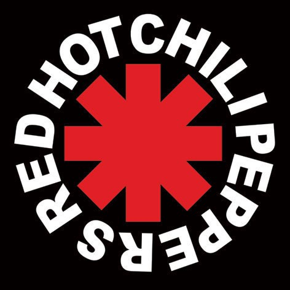

# Strona o Red Hot Chili Peppers

## Adres do strony: https://ledek8.github.io/homepage

### Projekt miał na celu naukę podstaw HTML, CSS oraz JS.
Podczas pisania tego projektu poznawałem i przypominałem sobie swoje umiejętności w pisaniu prostych stron internetowych.
Większą cześć czasu poświęciłem na CSS, ponieważ moim zdaniem to w nim miałem największe braki, ale również najlepiej się w tym czułem.
Na stronie znajduje się również drobne oprogramowanie w JS, które służy do zmiany obrazków, oraz kolorystyki tła.

### Zapraszam do sprawdzenia!
